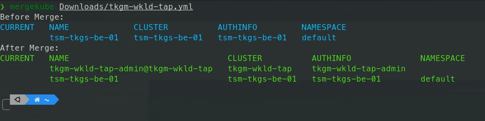
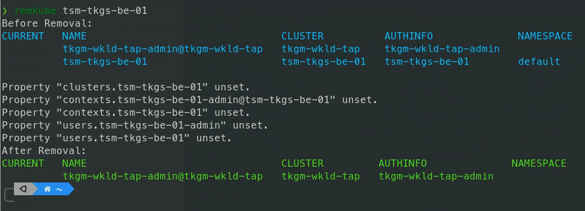

# mergekube & remkube

A pair of helpful scripts to merge and remove kubeconfig files. The syntax for merging kubeconfig files can be a bit challenging to remember. And for removing a cluster from a kubeconfig - oh boy! That's multiple commands to get it right. I wrote these two bash scripts a few years ago to make these two tasks easier for myself and others.

## Installation

### Manual Installation
1. Simply place the mergekube and remkube files in your path (IE: /usr/local/bin or $HOME/bin)
2. Make them executable: 
 ```bash
 chmod +x remkube
 chmod +x mergekube
 ```

### Script Installation

WARNING: Always review source code before doing such an installation. Be sure you understand and trust the code you are executing/installing!

Using curl:

```bash
bash -c "$(curl -fsSL https://raw.github.com/burkeazbill/MergekubeRemkube/main/install.sh)"
```

Using wget:

```bash
bash -c "$(wget -qO- https://raw.github.com/burkeazbill/MergekubeRemkube/main/install.sh)"
```


## mergekube Usage

```bash
mergekube <path-to-kubeconfig-to-merge>
```

For example:
```bash
mergekube tkgm-wkld-tap.yml
```

Sample Output:


## remkube Usage

```bash
remkube <cluster_name_to_remove>
```

For example:
```bash
remkube tsm-tkgs-be-01
```

Sample Output:
 
